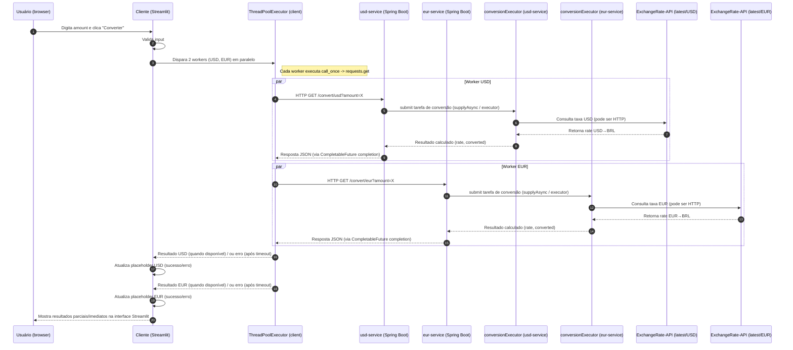

# Conversor de Moedas Distribuído com threads concorrentes — Spring Boot + Streamlit

Este projeto demonstra um sistema distribuído para conversão de moedas utilizando múltiplos serviços independentes:

* **Serviço USD → BRL (Spring Boot)**
* **Serviço EUR → BRL (Spring Boot)**
* **Cliente em Streamlit (Python)**
* **Comunicação entre containers via Docker Compose**

O objetivo é mostrar como o cliente consulta **dois serviços distintos** e exibe os resultados individualmente.

---





## Visão Geral

O sistema é composto por **três containers**:

1. **usd-service**
   Serviço em Spring Boot que converte USD → BRL.

2. **eur-service**
   Serviço em Spring Boot que converte EUR → BRL.

3. **cliente**
   Aplicação Streamlit que recebe o valor digitado pelo usuário e faz duas chamadas independentes:

   * `/convert/usd` no usd-service
   * `/convert/eur` no eur-service

Não existe endpoint combinado. Cada serviço é totalmente isolado.

---

## API — Estrutura dos Serviços

Cada serviço possui seu próprio endpoint:

### Serviço USD

```
GET /convert/usd?amount=100
```

Exemplo de resposta:

```json
{
  "from": "USD",
  "to": "BRL",
  "rate": 5.40,
  "converted": 540.00
}
```

### Serviço EUR

```
GET /convert/eur?amount=100
```

Exemplo de resposta:

```json
{
  "from": "EUR",
  "to": "BRL",
  "rate": 6.22,
  "converted": 622.00
}
```

### Funcionamento Interno dos Serviços

Cada serviço:

* Consulta sua própria fonte de taxas:
  * `latest/USD`
  * `latest/EUR`
* Executa a lógica de conversão
* Retorna o valor já convertido
* Pode usar `@Async` + `CompletableFuture` internamente (dependendo da implementação)
---

## Cliente (Streamlit)

O arquivo `cliente/app.py`:

* Recebe o valor digitado pelo usuário
* Formata e valida o input
* Lança duas requisições HTTP., de forma concorrente, uma para cada, uma para cada serviço:

  * `USD_URL` (usd-service)
  * `EUR_URL` (eur-service)
* Exibe cada resultado em sua coluna individual
* Mostra erros específicos caso algum serviço falhe

### URLs utilizadas pelo cliente

```python
USD_URL = "http://usd-service:8081/convert/usd"
EUR_URL = "http://eur-service:8082/convert/eur"
```

As requisições são feitas com uso de threads concorrentes.
```python
with ThreadPoolExecutor(max_workers=2) as executor:
        futuro_dict = {
            executor.submit(worker, "USD", USD_URL, amount): "USD",
            executor.submit(worker, "EUR", EUR_URL, amount): "EUR",
        }

        for futuro in as_completed(futuro_dict):
            nome_esperado = futuro_dict[futuro]
            try:
                nome_servico, ok, carga = futuro.result()
            except Exception as exc:
                ph = usd_ph if nome_esperado == "USD" else eur_ph
                ph.error(f"{nome_esperado} — erro inesperado: {exc}")
                continue

            ph = usd_ph if nome_servico == "USD" else eur_ph

            if not ok:
                ph.error(f"Erro {nome_servico}: {carga}")
            else:
                convertido = carga.get("converted") if isinstance(carga, dict) else None
                ph.success(format_converted(convertido))
```

---

## Fluxo Completo

1. O usuário digita um valor no Streamlit.
2. O cliente chama os dois workers de forma paralela
3. Exibe o resultado (ou erro) do que conseguir chegar primeiro de forma a não bloquear o cliente.
4. Cada serviço retorna seu cálculo de forma isolada.

---

## Como Executar com Docker

Pré-requisitos:

* Docker
* Docker Compose

Rodar na raiz do projeto:

```bash
docker-compose up --build
```

### Acessos

**Cliente (frontend)**
[http://localhost:8501](http://localhost:8501)

**Serviço USD**
[http://localhost:8081/convert/usd?amount=10](http://localhost:8081/convert/usd?amount=10)

**Serviço EUR**
[http://localhost:8082/convert/eur?amount=10](http://localhost:8082/convert/eur?amount=10)

---

## Exemplos de Uso

### Conversão USD → BRL

```
http://localhost:8081/convert/usd?amount=50
```

### Conversão EUR → BRL

```
http://localhost:8082/convert/eur?amount=50
```

---

## Tecnologias Utilizadas

* Java 17
* Spring Boot 3
* Python 3.11
* Streamlit
* Requests (HTTP client)
* Docker & Docker Compose
* ExchangeRate-API

---
